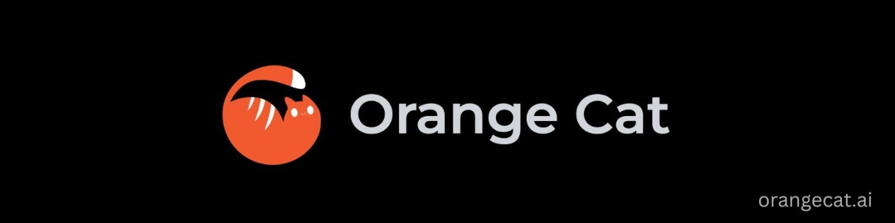

# 🐱 OrangeCat Technologies

> Changing the World, one token at a time.

  

## 🚀 About Us

At OrangeCat, we create powerful software designed to expand horizons. As a user-centric company based in Noida, India, we focus on leveraging the most advanced technologies to solve real-world problems that truly matter.

## 🔮 Lagrange

Lagrange is our flagship product - an AI-powered coding companion that transforms your development workflow. It turns requirements into production-ready code, automating your development process end-to-end.

### Key Features

- 🧠 **Model Selection**: Choose from state-of-the-art AI models optimized for your needs
- 💻 **Edge AI LLM via Ollama**: Run powerful language models locally
- 💬 **Chat with Code**: Natural language interactions with your codebase
- 🔍 **Codebase Indexing**: Intelligent organization and search
- 🌐 **Internet-Powered Agent**: Real-time information access
- ⌨️ **Advanced Code Editor**: Intelligent suggestions and real-time collaboration

## 🔗 Connect With Us

## 📧 Contact Us

- Email: [prithvi@orangecat.ai](mailto:prithvi@orangecat.ai)
- Support: [parth@orangecat.ai](mailto:parth@orangecat.ai)

  © 2024 OrangeCat Technologies Private Limited. All rights reserved.

